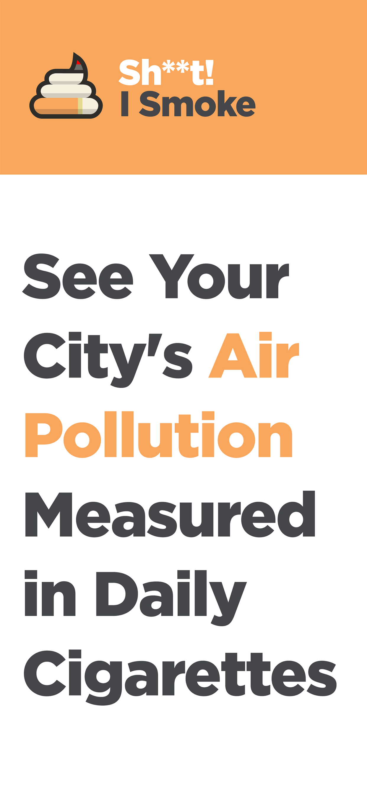
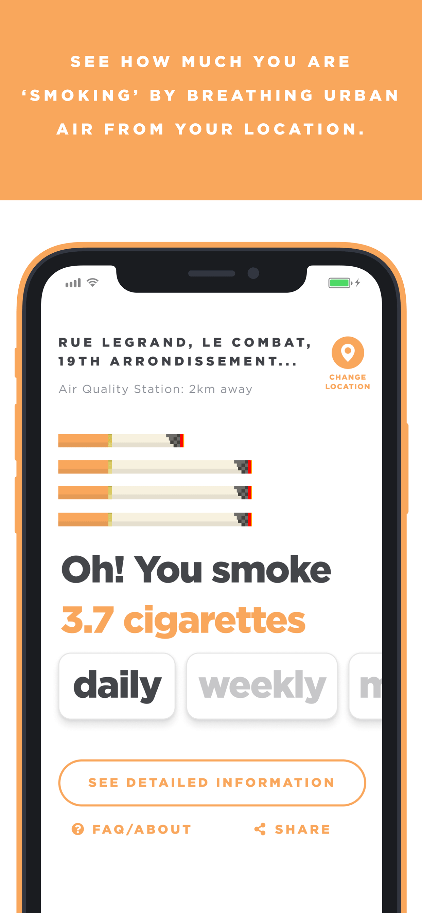
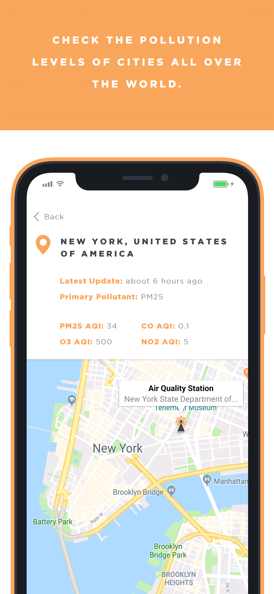
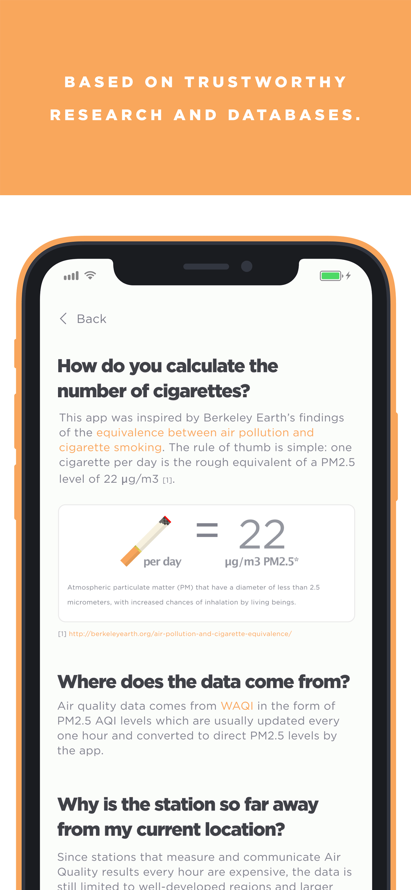
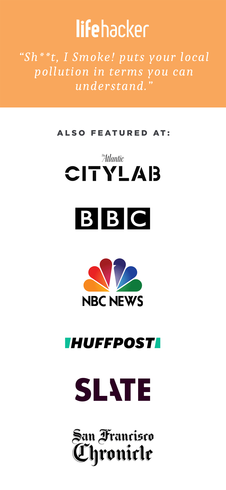

<p align="center" style="background-color: #F8A65D;">
    
    <h1 align="center">Shoot! I Smoke</h1>
</p>
<h4 align="center">Know how many cigarettes you smoke based on the pollution of your location</h4>

<p align="center">
  <a href="https://github.com/shootismoke/mobile-app/actions">
    
  </a>
  <a href="https://codeclimate.com/github/shootismoke/mobile-app/maintainability">
    
  </a>
</p>

<br />

<p align="center">
  <a href="https://itunes.apple.com/us/app/s-i-smoke/id1365605567?mt=8">
    
  </a>
  <a href="https://play.google.com/store/apps/details?id=com.shitismoke.app">
    
  </a>
</p>

<br />

---

<p align="center">
  
  
  
  
  
</p>

---

## :iphone: Try it on Expo

This app is bootstrapped with [Expo](https://expo.io), you can download the Expo app on the [App Store](https://itunes.apple.com/us/app/expo-client/id982107779) or [Play Store](https://play.google.com/store/apps/details?id=host.exp.exponent), and enter the url provided below. We have 2 release channels:

| Release Channel                                                                           | Version | Description                                                                 | Url                                                                           |
| ----------------------------------------------------------------------------------------- | ------- | --------------------------------------------------------------------------- | ----------------------------------------------------------------------------- |
| [Production](https://exp.host/@amaurymartiny/shootismoke?release-channel=production-v1.8) | v1.8.10 | Same version as Shoot! I Smoke on the App Store and Play Store.             | `https://exp.host/@shootismoke/mobile-app?release-channel=production-v1.8.10` |
| [Staging](https://exp.host/@amaurymartiny/shootismoke)                                    | v1.8.10 | Latest version currently in development: newest features, may contain bugs. | `https://exp.host/@shootismoke/mobile-app`                                    |

## :hammer: Build it yourself

Run the following commands:

```bash
# Clone this repo
git clone https://github.com/shootismoke/mobile-app && cd shoot-i-smoke
# Install dependencies
yarn install

# Copy secrets
cp .env.example .env

# Run the app with Expo
yarn start
```

The [Expo](https://expo.io) packager will show, and you can either:

-   install the Expo app, scan the displayed QR code, and run the app on your mobile phone directly.
-   open the Android simulator.
-   open the iOS simulator.

#### Use your own API tokens

All required API tokens are already pre-filled in `eas.json`. If you want to use your own API tokens, then in `eas.json`'s `env` field, add your own values. For those that are optional, you can just put `null` (without quotes).

| Name              |                         | Service                                                        | Url                                                                 | Comments |
| ----------------- | ----------------------- | -------------------------------------------------------------- | ------------------------------------------------------------------- | -------- |
| GEOAPIFY_API_KEY  | Geoapify geocoding      | https://geoapify.com                                           | Required. Get your own and populate it in `.env`                    |
| BACKEND_SECRET    | Shoot! I Smoke Backend  | https://github.com/shootismoke/backend                         | Required. Pre-filled with a staging token.                          |
| AQICN_TOKEN       | World Air Quality Index | http://aqicn.org/api/                                          | Required. You can use the public one in `eas.json` for development. |
| SENTRY_PUBLIC_DSN | Sentry Bug Tracking     | https://sentry.io                                              | Optional.                                                           |
| AMPLITUDE_API_KEY | Amplitude Analytics     | https://amplitude.com                                          | Optional. Note: we **never** track PII.                             |
|                   | Google Maps for iOS     | https://developers.google.com/maps/documentation/ios-sdk/start | Optional in development.                                            |
|                   | Google Maps for Android | https://developers.google.com/maps/documentation/android-api/  | Optional in development.                                            |

## :raising_hand: Contribute

If you find a bug, or if you have an idea for this app, please [file an issue here](https://github.com/shootismoke/mobile-app/issues). We really appreciate feedback and inputs! For code contribution, you can start with these [easy tasks](https://github.com/shootismoke/mobile-app/issues?q=is%3Aissue+is%3Aopen+label%3A%22good+first+issue%22).

More information on contributing [here](./CONTRIBUTING.md).

## :microscope: Tests

The codebase unfortunately isn't much covered by tests. Check out the `*.spec.ts` files in the project for tests. If you're interested to help out, have a look at [issue #19](https://github.com/shootismoke/mobile-app/issues/19).

## Releases

The app released on the App Store and Play Store is always the one on the `production` branch. We use [EAS Update](https://docs.expo.dev/build/updates/) to remotely update the app when necessary. In general, this means that the semver patch version is bumped.

For major updates that don't work via EAS Update (such as an Expo SDK version bump), a new app binary is created using the commands below. In general, this means that the semver minor version is bumped.

```bash
# IOS
eas build -p ios
eas submit -p ios

# Android
eas build -p android
eas submit -p android
```

## :newspaper: License

GPL-3.0. See [LICENSE](./LICENSE) file for more information.

## :star: Credits

Created with pride by [Marcelo](http://www.marcelocoelho.cc) & [Amaury](https://amaurym.com).

A **huge** thanks to the following contributors for their amazing work:

-   [@lucienbl](https://github.com/lucienbl)

---

<a href="https://www.producthunt.com/posts/sh-t-i-smoke?utm_source=badge-featured&utm_medium=badge&utm_souce=badge-sh-t-i-smoke" target="_blank"></a>
